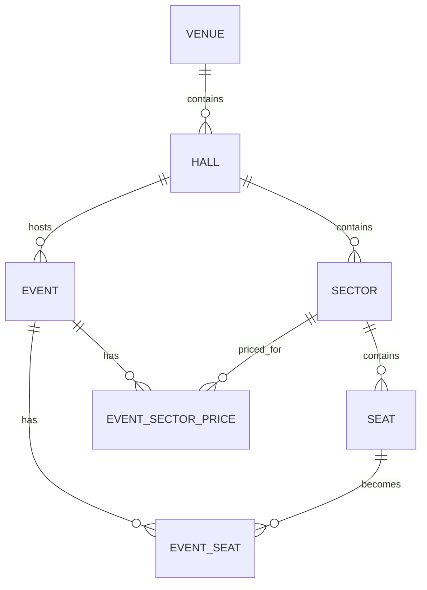

# SeatFlow Backend

SeatFlow — backend-платформа для управления площадками, залами, схемами мест и событиями.

Организаторы создают площадки, залы, сектора и события, а также настраивают стоимость мест по секторам. В дальнейшем пользователи смогут выбирать места, временно бронировать их, оплачивать билеты и получать уведомления.

---

## Стек

| Технология | Использование |
|---|---|
| Java 21 | Основной язык |
| Spring Boot | Backend-приложение |
| Spring Web | REST API |
| Spring Data JPA | Работа с БД |
| Hibernate | ORM |
| PostgreSQL | Основная база данных |
| Flyway | Миграции |
| Testcontainers | Интеграционные тесты |
| JUnit 5 | Тестирование |
| Mockito | Unit-тесты |
| OpenAPI / Swagger | Документация API |
| Docker Compose | Локальная инфраструктура |

---

## Быстрый старт

### 1. Создать `.env`

```powershell
Copy-Item .env.example .env
```

### 2. Запустить PostgreSQL

```powershell
docker compose up -d postgres
```

Проверить состояние:

```powershell
docker compose ps
```

Проверить подключение:

```powershell
docker compose exec postgres psql -U seatflow -d seatflow -c "SELECT 1 AS result;"
```

### 3. Запустить приложение

```powershell
.\mvnw.cmd spring-boot:run
```

По умолчанию:

```text
http://localhost:18080
```

Порт можно переопределить переменной окружения `SERVER_PORT`.

### 4. Запустить тесты

```powershell
.\mvnw.cmd clean verify
```

### 5. Остановить PostgreSQL

```powershell
docker compose down
```

---

## Документация API

| Ресурс | URL |
|---|---|
| Swagger UI | http://localhost:18080/swagger-ui/index.html |
| OpenAPI JSON | http://localhost:18080/v3/api-docs |

Если приложение запущено на другом порту, замените `18080` на используемый порт.

---

## Доступные endpoint'ы

### System

| Метод | Endpoint | Описание |
|---|---|---|
| `GET` | `/api/v1/system/ping` | Проверка доступности приложения |
| `GET` | `/actuator/health` | Health check |

### Venues

| Метод | Endpoint | Описание |
|---|---|---|
| `POST` | `/api/v1/venues` | Создать площадку |
| `GET` | `/api/v1/venues` | Получить список площадок |
| `GET` | `/api/v1/venues/{id}` | Получить площадку по ID |

### Halls

| Метод | Endpoint | Описание |
|---|---|---|
| `POST` | `/api/v1/venues/{venueId}/halls` | Создать зал на площадке |
| `GET` | `/api/v1/venues/{venueId}/halls` | Получить залы площадки |
| `GET` | `/api/v1/halls/{hallId}` | Получить зал по ID |

### Sectors

| Метод | Endpoint | Описание |
|---|---|---|
| `POST` | `/api/v1/halls/{hallId}/sectors` | Создать сектор в зале |
| `GET` | `/api/v1/halls/{hallId}/sectors` | Получить сектора зала |

### Seats

| Метод | Endpoint | Описание |
|---|---|---|
| `GET` | `/api/v1/sectors/{sectorId}/seats` | Получить места сектора |

Места создаются автоматически при создании сектора.

### Events

| Метод | Endpoint | Описание |
|---|---|---|
| `POST` | `/api/v1/halls/{hallId}/events` | Создать событие в зале |
| `GET` | `/api/v1/halls/{hallId}/events` | Получить события зала |
| `GET` | `/api/v1/events/{eventId}/seats` | Получить места события и их статусы |
| `PUT` | `/api/v1/events/{eventId}/prices` | Установить или обновить цены по секторам |
| `GET` | `/api/v1/events/{eventId}/prices` | Получить цены события по секторам |

---

## Примеры API

### Создание площадки

```http
POST /api/v1/venues
Content-Type: application/json
```

```json
{
  "name": "Luzhniki Stadium",
  "city": "Moscow",
  "address": "Luzhnetskaya Naberezhnaya, 24",
  "timezone": "Europe/Moscow"
}
```

Успешный запрос возвращает `201 Created`.

При наличии endpoint для получения созданного ресурса сервер может вернуть:

```text
Location: /api/v1/venues/{id}
```

Часовой пояс должен быть корректным IANA identifier, например `Europe/Moscow`.

---

### Создание сектора

```http
POST /api/v1/halls/{hallId}/sectors
Content-Type: application/json
```

```json
{
  "name": "VIP",
  "rowCount": 10,
  "seatsPerRow": 20
}
```

При создании сектора SeatFlow автоматически создаёт места:

```text
10 рядов × 20 мест = 200 мест
```

Места нумеруются по рядам:

```text
Ряд 1: место 1, место 2, место 3, ...
Ряд 2: место 1, место 2, место 3, ...
```

---

### Создание события

```http
POST /api/v1/halls/{hallId}/events
Content-Type: application/json
```

```json
{
  "title": "Football Match",
  "description": "Championship match",
  "startsAt": "2026-10-10T16:00:00Z",
  "endsAt": "2026-10-10T19:00:00Z"
}
```

Бизнес-правило:

```text
endsAt > startsAt
```

Если время окончания не позже времени начала, API возвращает `400 Bad Request`.

События зала возвращаются отсортированными по `startsAt`.

---

### Получение мест события

```http
GET /api/v1/events/{eventId}/seats
```

Возвращает места указанного события с информацией о секторе, ряде, номере места и текущем статусе.

Возможные статусы:

- `AVAILABLE` — доступно;
- `RESERVED` — временно забронировано;
- `SOLD` — продано;
- `BLOCKED` — заблокировано.

При создании события для каждого физического места его зала автоматически создаётся место события со статусом `AVAILABLE`.

---

### Настройка цен события по секторам

```http
PUT /api/v1/events/{eventId}/prices
Content-Type: application/json
```

```json
{
  "prices": [
    {
      "sectorId": "11111111-1111-1111-1111-111111111111",
      "amount": 1500.00,
      "currency": "RUB"
    },
    {
      "sectorId": "22222222-2222-2222-2222-222222222222",
      "amount": 2500.00,
      "currency": "RUB"
    }
  ]
}
```

Повторный PUT-запрос для той же пары `eventId + sectorId` обновляет существующую цену и не создаёт дубликат.

Правила:

- сектор должен принадлежать залу, в котором проходит событие;
- один сектор нельзя передавать в запросе несколько раз;
- сумма не может быть отрицательной;
- сумма содержит не более двух знаков после запятой;
- валюта передаётся трёхбуквенным кодом ISO 4217 в верхнем регистре, например `RUB`, `USD` или `EUR`.

Получение настроенных цен:

```http
GET /api/v1/events/{eventId}/prices
```

Пример ответа:

```json
[
  {
    "id": "33333333-3333-3333-3333-333333333333",
    "eventId": "44444444-4444-4444-4444-444444444444",
    "sectorId": "11111111-1111-1111-1111-111111111111",
    "sectorName": "Parterre",
    "amount": 1500.00,
    "currency": "RUB",
    "createdAt": "2026-10-01T12:00:00Z",
    "updatedAt": "2026-10-01T12:00:00Z"
  }
]
```

---

## API conventions

| Правило | Значение |
|---|---|
| Базовый путь | `/api/v1` |
| Формат данных | JSON |
| ID ресурсов | UUID |
| Дата и время | UTC, ISO 8601 |
| Создание ресурса | `201 Created` |
| Ошибки | `ApiErrorResponse` |

---

## HTTP-статусы

| Статус | Описание |
|---|---|
| `200 OK` | Запрос успешно выполнен |
| `201 Created` | Ресурс успешно создан |
| `400 Bad Request` | Некорректный JSON, UUID или ошибка валидации |
| `404 Not Found` | Запрашиваемый ресурс не найден |
| `405 Method Not Allowed` | HTTP-метод не поддерживается |
| `409 Conflict` | Ресурс конфликтует с существующими данными |
| `500 Internal Server Error` | Непредвиденная ошибка сервера |

---

## Формат ошибок API

```json
{
  "timestamp": "2026-09-01T12:00:00Z",
  "status": 404,
  "code": "RESOURCE_NOT_FOUND",
  "message": "Venue not found",
  "path": "/api/v1/venues/3d03415e-2494-410f-b6f6-12b6e3610290",
  "fieldErrors": []
}
```

### Коды ошибок

| Код | HTTP | Описание |
|---|---:|---|
| `VALIDATION_ERROR` | 400 | Ошибка проверки входных данных |
| `MALFORMED_REQUEST` | 400 | Некорректный JSON |
| `RESOURCE_NOT_FOUND` | 404 | Ресурс или endpoint не найден |
| `METHOD_NOT_ALLOWED` | 405 | HTTP-метод не поддерживается |
| `RESOURCE_CONFLICT` | 409 | Конфликт с существующими данными |
| `INTERNAL_ERROR` | 500 | Непредвиденная внутренняя ошибка |

Для внутренних ошибок клиенту не возвращаются stack trace и технические детали исключения.

---

## Миграции базы данных

Для миграций используется Flyway.

Каталог:

```text
src/main/resources/db/migration
```

История миграций:

```text
public.flyway_schema_history
```

### Текущие миграции

| Версия | Назначение |
|---|---|
| `V1` | Создание схемы `seatflow` |
| `V2` | Площадки |
| `V3` | Залы |
| `V4` | Сектора и места |
| `V5` | События |
| `V6` | Места событий и их статусы |
| `V7` | Цены события по секторам |

Актуальные файлы последних миграций:

```text
V6__create_event_seats.sql
V7__create_event_sector_prices.sql
```

Hibernate при запуске проверяет соответствие JPA-моделей текущей схеме БД.

Интеграционные тесты используют Testcontainers и отдельный PostgreSQL-контейнер.

---

## Текущая модель предметной области



`Seat` описывает физическое место в зале.

`Event` описывает событие, которое проходит в конкретном зале.

`EventSeat` описывает состояние физического места для конкретного события.

`EventSectorPrice` хранит стоимость места в конкретном секторе для конкретного события. Денежная сумма представлена value object `Money`, который объединяет `amount` и `currency`.

Временное бронирование, оплата и пользовательские роли будут добавлены в следующих задачах.
